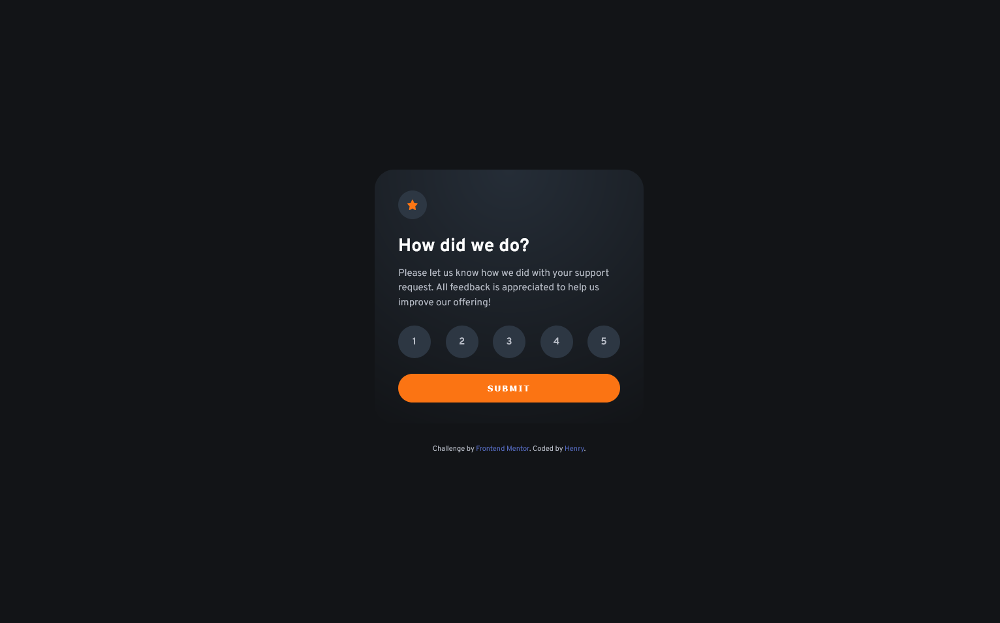

# Frontend Mentor - Interactive rating component

This is a solution to the [Interactive rating component challenge on Frontend Mentor](https://www.frontendmentor.io/challenges/interactive-rating-component-koxpeBUmI). 

## Table of contents

- [Overview](#overview)
  - [The challenge](#the-challenge)
  - [Screenshot](#screenshot)
  - [Links](#links)
- [My process](#my-process)
  - [Built with](#built-with)
  - [What I learned](#what-i-learned)
  - [Continued development](#continued-development)
- [Author](#author)

## Overview

### The challenge

Users should be able to:

- View the optimal layout for the app depending on their device's screen size
- See hover states for all interactive elements on the page
- Select and submit a number rating
- See the "Thank you" card state after submitting a rating

### Screenshot



### Links

- Solution URL: [https://github.com/henrydevlab/interactive-rating-component](https://github.com/henrydevlab/interactive-rating-component)
- Live Site URL: [https://henrydevlab.github.io/interactive-rating-component/](https://henrydevlab.github.io/interactive-rating-component/)

## My process

### Built with

- Semantic HTML5 markup
- CSS custom properties
- Flexbox
- Mobile-first workflow
- BEM (Block Element Modifier)
- Accessible Native Form Handling (ARIA-compliant radio elements)

### What I learned

During this project, I focused on building interactive forms while keeping accessibility (A11y) at the center of my workflow. 

Instead of using generic structural `<div>` elements for the selection buttons, I utilized an underlying native `<input type="radio">` grouping styled with CSS pseudo-classes. This ensures screen-reader visibility and full keyboard navigation controls without breaking visual alignment.

To achieve smooth transitions without relying on complex frameworks, I styled the layout via standard target selector combinations like :checked, :hover, and :focus-visible:

```css
/* Styling the sibling text element cleanly when the native overlay radio state changes */
.card__rating-input:checked + .card__rating-button {
  background-color: var(--clr-primary-orange);
  color: var(--clr-neutral-white);
}

.card__rating-input:focus-visible + .card__rating-button {
  outline: 2px solid var(--clr-neutral-white);
  outline-offset: 3px;
}
```
On the JavaScript side, I leveraged the standard FormData API to abstract value retrieval during submission instead of creating global tracking variables or mutating elements iteratively.

```js
// Intercept submit event and pull form token mappings smoothly
const formData = new FormData(ratingForm);
const selectedRating = formData.get('rating');

if (selectedRating) {
  selectedRatingValue.textContent = selectedRating;
  ratingView.classList.add('card__view--hidden');
  thankYouView.classList.remove('card__view--hidden');
}
```

### Continued development

Moving forward, I intend to build deeper habits around:

- **ARIA Announcements:** Expanding the use of `aria-live` containers to ensure immediate announcements to assistive tech whenever structural sub-views flip dynamically.
- **Micro-animations:** Incorporating CSS keyframes to subtly scale the active star elements or card transitions upon successful state submission.

## Author

- Frontend Mentor - [@henrydevlab](https://www.frontendmentor.io/profile/henrydevlab)
- Twitter - [@henrydevlab](https://www.twitter.com/henrydevlab)
